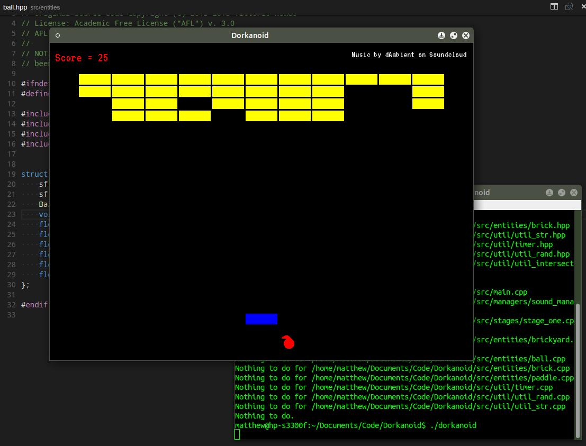

### Dorkanoid

This **Arkanoid**-like game was inspired by the following Youtube tutorial by 
Vittorio Romeo. It's a good introduction to the SFML library and uses C++ 11
features. 

* [Arkanoid Clone Tutorial](https://www.youtube.com/watch?v=_4K3tsKa1Uc)
* [Github](https://github.com/SuperV1234/Tutorials)

After following the tutorial, I've enhanced the code and added the following
features:

* Stages
* Improved code structure
* Points
* Music and sound effects
* Randomization of ball mechanics

### Media Credits

Music created by freesound user [dAmbient](http://www.freesound.org/people/dAmbient/)
and licensed under the [CC Attribution License](http://creativecommons.org/licenses/by/3.0/).

Sound effects created using the awesome [JSFXR](http://github.grumdrig.com/jsfxr/).

### Arkanoid

For those of you retro gaming nuts, you'll notice that this version differs 
pretty significantly from the original. The goal of the project isn't 
to create a clone of the original game, but to create a game in similar style
that's still enjoyable to play. 

If you'd like a true Arkanoid clone, you should take this project as a starting
point and build your own! ;)

[History of Arkanoid](https://en.wikipedia.org/wiki/Arkanoid)

### Instructions to Build:

While this game is theoretically cross-platform, at this point I've done all
development on Linux (Ubuntu). To build the game on linux, install libsfml:

	sudo apt-get install libsfml-dev build-essential
	
I use a python script for building the project. It works with Python 2 or 3:

	python build.py
	
As with make, this script will only build the source files that have been 
modified. 

### License:

Original code distributed under the following license terms:

	// Inspired by https://github.com/SuperV1234/Tutorials
	//
	// Original source code Copyright (c) 2013-2015 Vittorio Romeo
	// License: Academic Free License ("AFL") v. 3.0
	// AFL License page: http://opensource.org/licenses/AFL-3.0
	// 
	// NOTICE: According to the terms of the AFL-3.0, this code has
	// been substantially altered from the original by Matthew MacGregor.
	
Some code files are new/original, and these I have licensed conveniently
using the AFL-3.0 as well:

	// Copyright (c) 2015 Matthew MacGregor
	// License: Academic Free License ("AFL") v. 3.0
	// AFL License page: http://opensource.org/licenses/AFL-3.0
